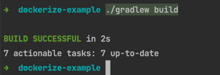
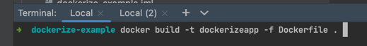
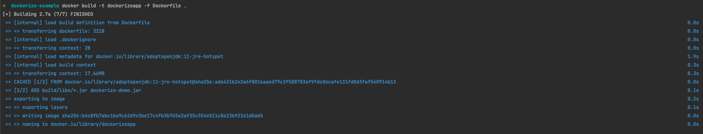
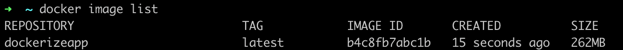
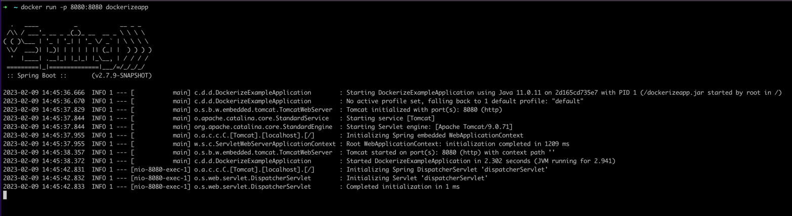

# How to dockerize a spring-boot project?

We will learn how to dockerize a spring boot project in a basic and simple way.

# Project Dependencies

Libraries required for the project
- Java 11
- Docker

# Project About

Let's imagine we have a spring boot application and we want to "Dockerize" it. For this, we created a file named "DockerFile" in the main directory of our project.You can find explanations in DockerFile.

# How to dockerize?
1-Create a controller class that will do a simple "GET" operation (you can find it under controller) and return "Hello World" to the client side.

2-We need to "Build" our project to create the files and JAR files.

3-Create a DockerFile in the project mainframe (you can see it in the project content)

4-Design the DockerFile according to the application specifications. You can find descriptions in DockerFile (JDK, PORT settings etc.)

4-Run this command on the terminal 

5- You should see these actions after the command

6 - After the successful completion of the process, we should be able to see our existing docker images with the "docker image" command to check them.

7 - Now let's run docker image. (docker run -p 8080:8080 dockerizeapp)

8 - Test! Have fun! :) 

# API

| API    | Functions                |
|--------|--------------------------|
| /hello | [GET] Return Hello World |

